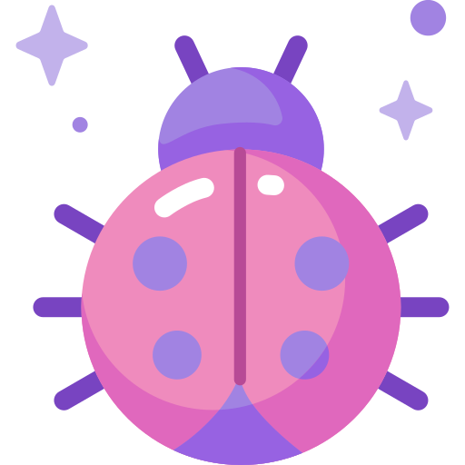

    

#  <b>INFO</b>

### <b>I am — Software QA Engineer</b> 

My name is <b>Aleksei Lunin</b>, and I have 2 years of experience in UI, API, and Mobile testing. I have a strong passion for learning and continually seek to expand my horizons by studying new technologies and tools that can enhance my testing capabilities.

 

##  <b>Tools</b>

    
    
    
    
    
    
    
    
    
     
    
    
    
    
    

##  <b>Links</b>

    &nbsp;

 

    

    

